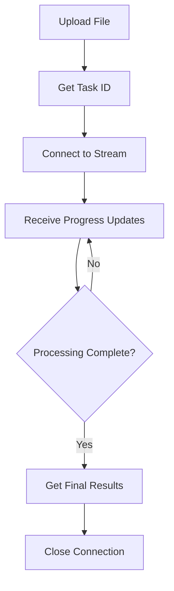

# 🌟 Unified OCR API Guide

**One Endpoint for ALL File Types - Images, PDFs, and DOCX Documents**

---

## 📋 Table of Contents

1. [🎯 Overview](#-overview)
2. [🚀 Quick Start](#-quick-start)
3. [📁 Supported File Types](#-supported-file-types)
4. [🌊 Streaming Processing](#-streaming-processing)
5. [⚙️ Processing Modes](#️-processing-modes)
6. [🔧 API Reference](#-api-reference)
7. [✨ Frontend Integration](#-frontend-integration)
8. [📊 Response Formats](#-response-formats)
9. [🛠️ Migration Guide](#️-migration-guide)
10. [❌ Error Handling](#-error-handling)
11. [📈 Performance Tips](#-performance-tips)
12. [🧪 Testing](#-testing)

---

## 🎯 Overview

The **Unified OCR API** provides a single, intelligent endpoint that automatically detects file types and routes them to the appropriate processing pipeline. Whether you're working with images, PDFs, or DOCX documents, you only need to know **one endpoint**.

### ✨ Key Features

- **🔍 Auto File Type Detection**: Upload any supported file - we'll figure out what it is
- **🌊 Real-time Streaming**: Live progress updates via Server-Sent Events (SSE)
- **🧠 LLM Enhancement**: Optional AI-powered text improvement for better accuracy
- **📊 Universal Progress Tracking**: Standardized progress updates for all file types
- **⚡ Intelligent Routing**: Optimized processing pipelines per file type
- **🔄 Task Management**: Cancel tasks, check status, and manage processing
- **🛡️ Comprehensive Error Handling**: Detailed error messages and graceful fallbacks

---

## 🚀 Quick Start

### Basic Upload (Any File Type)

```bash
# Upload any supported file type
curl -X POST "http://localhost:8000/v1/ocr/process-stream" \
  -F "file=@your-document.pdf" \
  -F "request={\"mode\": \"basic\"}"
```

### Get Real-time Updates

```bash
# Connect to streaming updates
curl -N "http://localhost:8000/v1/ocr/stream/{task_id}"
```

### Frontend JavaScript Example

```javascript
// 🎯 Universal file upload - works with ANY file type!
const uploadFile = async (file) => {
    const formData = new FormData();
    formData.append('file', file);
    formData.append('request', JSON.stringify({
        mode: 'llm_enhanced',
        threshold: 500,
        prompt: 'Extract all text accurately'
    }));
    
    const response = await fetch('/v1/ocr/process-stream', {
        method: 'POST',
        body: formData
    });
    
    const {task_id} = await response.json();
    
    // Connect to real-time streaming
    const eventSource = new EventSource(`/v1/ocr/stream/${task_id}`);
    
    eventSource.onmessage = (event) => {
        const update = JSON.parse(event.data);
        
        // Universal handling - works for all file types!
        if (update.latest_page_result) {
            displayNewResult(update.latest_page_result);
        }
        
        if (update.status === 'completed') {
            console.log('✅ Processing completed!');
            eventSource.close();
        }
    };
};
```

---

## 📁 Supported File Types

| File Type | Extensions | Max Size | Description |
|-----------|------------|----------|-------------|
| **🖼️ Images** | `.jpg`, `.jpeg`, `.png`, `.bmp`, `.tiff`, `.webp` | 10MB | Direct image OCR processing |
| **📄 PDFs** | `.pdf` | 50MB (max 10 pages) | Page-by-page OCR with image extraction |
| **📝 Documents** | `.docx` | 25MB | Document → PDF → Image → OCR pipeline |

### Auto-Detection Examples

```javascript
// These all work with the SAME endpoint! 🎉
await uploadFile(imageFile);   // ✅ Auto-detected as IMAGE
await uploadFile(pdfFile);     // ✅ Auto-detected as PDF  
await uploadFile(docxFile);    // ✅ Auto-detected as DOCX
```

---

## 🌊 Streaming Processing

### Connection Flow



### Server-Sent Events Format

```
data: {"task_id": "uuid", "status": "processing", "progress_percentage": 25.0}

data: {"task_id": "uuid", "status": "page_completed", "latest_page_result": {...}}

data: {"task_id": "uuid", "status": "completed", "cumulative_results": [...]}
```

### Streaming Update Types

| Update Type | Description | When Triggered |
|-------------|-------------|----------------|
| `processing` | General progress update | Every major processing step |
| `page_completed` | Individual page/unit complete | After each page/section |
| `completed` | All processing finished | Final results available |
| `failed` | Processing failed | Error occurred |
| `cancelled` | User cancelled task | Task manually stopped |

---

## ⚙️ Processing Modes

### 🔥 Basic Mode
- **Speed**: ⚡ Fast
- **Accuracy**: ✅ Good
- **Use Case**: High-volume processing, clear documents
- **Process**: Image → OCR Engine → Text

```json
{
    "mode": "basic",
    "threshold": 500,
    "contrast_level": 1.3,
    "dpi": 300
}
```

### 🧠 LLM Enhanced Mode  
- **Speed**: 🐌 Slower (3-5x)
- **Accuracy**: 🎯 Excellent
- **Use Case**: Important documents, complex layouts, poor quality scans
- **Process**: Image → OCR Engine → LLM Enhancement → Improved Text

```json
{
    "mode": "llm_enhanced", 
    "threshold": 500,
    "prompt": "Extract all text accurately, preserving formatting and structure",
    "model": "gpt-4-vision-preview"
}
```

### Parameter Reference

| Parameter | Type | Default | Range | Description |
|-----------|------|---------|-------|-------------|
| `mode` | enum | `"basic"` | `basic` \| `llm_enhanced` | Processing mode |
| `threshold` | int | `500` | `0-1024` | Image binarization threshold |
| `contrast_level` | float | `1.3` | `0.1-5.0` | Image contrast enhancement |
| `dpi` | int | `300` | `150-600` | Image resolution for processing |
| `prompt` | string | `null` | - | LLM instruction (LLM mode only) |
| `model` | string | `null` | - | LLM model name (LLM mode only) |

---

## 🔧 API Reference

### Main Unified Endpoint

#### `POST /v1/ocr/process-stream`

**Upload any supported file for streaming OCR processing.**

**Request:**
```http
POST /v1/ocr/process-stream
Content-Type: multipart/form-data

file: <any_supported_file>
request: <json_parameters> (optional)
```

**Response:**
```json
{
    "task_id": "12345678-1234-1234-1234-123456789012",
    "file_type": "pdf",
    "processing_mode": "basic", 
    "status": "processing",
    "created_at": "2024-01-15T10:30:00Z",
    "estimated_duration": 15.5,
    "file_metadata": {
        "original_filename": "document.pdf",
        "file_size_bytes": 2048576,
        "detected_file_type": "pdf",
        "pdf_page_count": 5
    }
}
```

### Streaming Connection

#### `GET /v1/ocr/stream/{task_id}`

**Connect to real-time processing updates via Server-Sent Events.**

**Response:**
```
Content-Type: text/event-stream

data: {"task_id": "uuid", "status": "processing", "progress_percentage": 45.0}

data: {"task_id": "uuid", "status": "completed", "cumulative_results": [...]}
```

### Task Management

#### `POST /v1/ocr/tasks/{task_id}/cancel`

**Cancel a running processing task.**

**Request:**
```json
{
    "reason": "User requested cancellation"
}
```

**Response:**
```json
{
    "task_id": "uuid",
    "status": "cancelled", 
    "message": "Task cancelled successfully",
    "cancelled_at": "2024-01-15T10:35:00Z",
    "cancellation_reason": "User requested cancellation"
}
```

#### `GET /v1/ocr/tasks/{task_id}/status`

**Get current status and information for a processing task.**

**Response:**
```json
{
    "task_id": "uuid",
    "file_type": "image",
    "processing_mode": "llm_enhanced",
    "status": "completed",
    "created_at": "2024-01-15T10:30:00Z",
    "completed_at": "2024-01-15T10:32:15Z",
    "result": {
        "extracted_text": "Final processed text...",
        "pages_processed": 1,
        "total_processing_time": 135.2
    }
}
```

---

## ✨ Frontend Integration

### React Component Example

```jsx
import React, { useState, useRef } from 'react';

const UniversalOCRUploader = () => {
    const [uploadStatus, setUploadStatus] = useState('idle');
    const [progress, setProgress] = useState(0);
    const [results, setResults] = useState([]);
    const eventSourceRef = useRef(null);
    
    const handleFileUpload = async (file) => {
        setUploadStatus('uploading');
        setProgress(0);
        setResults([]);
        
        try {
            // 🎯 Works with ANY file type!
            const formData = new FormData();
            formData.append('file', file);
            formData.append('request', JSON.stringify({
                mode: 'llm_enhanced',
                threshold: 500,
                prompt: 'Extract all text accurately'
            }));
            
            const response = await fetch('/v1/ocr/process-stream', {
                method: 'POST',
                body: formData
            });
            
            if (!response.ok) throw new Error('Upload failed');
            
            const { task_id } = await response.json();
            
            // Connect to streaming updates
            connectToStream(task_id);
            
        } catch (error) {
            setUploadStatus('error');
            console.error('Upload failed:', error);
        }
    };
    
    const connectToStream = (taskId) => {
        setUploadStatus('processing');
        
        eventSourceRef.current = new EventSource(`/v1/ocr/stream/${taskId}`);
        
        eventSourceRef.current.onmessage = (event) => {
            const update = JSON.parse(event.data);
            
            // Universal progress handling
            if (update.progress_percentage !== undefined) {
                setProgress(update.progress_percentage);
            }
            
            // Handle new page results
            if (update.latest_page_result) {
                setResults(prev => [...prev, update.latest_page_result]);
            }
            
            // Handle completion
            if (update.status === 'completed') {
                setUploadStatus('completed');
                setProgress(100);
                eventSourceRef.current.close();
            }
            
            // Handle errors
            if (update.status === 'failed') {
                setUploadStatus('error');
                eventSourceRef.current.close();
            }
        };
        
        eventSourceRef.current.onerror = () => {
            setUploadStatus('error');
            eventSourceRef.current.close();
        };
    };
    
    const cancelProcessing = async (taskId) => {
        try {
            await fetch(`/v1/ocr/tasks/${taskId}/cancel`, {
                method: 'POST',
                headers: { 'Content-Type': 'application/json' },
                body: JSON.stringify({ reason: 'User cancelled' })
            });
            
            eventSourceRef.current?.close();
            setUploadStatus('cancelled');
            
        } catch (error) {
            console.error('Cancel failed:', error);
        }
    };
    
    return (
        <div className="ocr-uploader">
            <input 
                type="file" 
                accept=".jpg,.jpeg,.png,.pdf,.docx"
                onChange={(e) => handleFileUpload(e.target.files[0])}
                disabled={uploadStatus === 'processing'}
            />
            
            {uploadStatus === 'processing' && (
                <div className="progress">
                    <div className="progress-bar" style={{width: `${progress}%`}} />
                    <span>{progress.toFixed(1)}% Complete</span>
                </div>
            )}
            
            <div className="results">
                {results.map((result, index) => (
                    <div key={index} className="result-item">
                        <h4>Page {result.page_number}</h4>
                        <p>{result.extracted_text}</p>
                        <small>Processed in {result.processing_time}s</small>
                    </div>
                ))}
            </div>
        </div>
    );
};

export default UniversalOCRUploader;
```

### Vue.js Example

```vue
<template>
  <div class="universal-ocr">
    <!-- File Upload -->
    <input 
      ref="fileInput"
      type="file" 
      accept=".jpg,.jpeg,.png,.pdf,.docx"
      @change="handleFileUpload"
      :disabled="isProcessing"
    />
    
    <!-- Progress Display -->
    <div v-if="isProcessing" class="progress-container">
      <div class="progress-bar">
        <div :style="{width: progress + '%'}" class="progress-fill"></div>
      </div>
      <p>{{ progress.toFixed(1) }}% - {{ currentStep }}</p>
      <button @click="cancelProcessing">Cancel</button>
    </div>
    
    <!-- Results Display -->
    <div v-if="results.length" class="results">
      <h3>Extracted Text:</h3>
      <div v-for="result in results" :key="result.page_number" class="result-item">
        <h4>{{ fileType === 'image' ? 'Result' : `Page ${result.page_number}` }}</h4>
        <pre>{{ result.extracted_text }}</pre>
        <small>Processed in {{ result.processing_time }}s</small>
      </div>
    </div>
  </div>
</template>

<script>
export default {
  name: 'UniversalOCR',
  data() {
    return {
      isProcessing: false,
      progress: 0,
      currentStep: '',
      results: [],
      currentTaskId: null,
      eventSource: null,
      fileType: null
    };
  },
  methods: {
    async handleFileUpload(event) {
      const file = event.target.files[0];
      if (!file) return;
      
      this.isProcessing = true;
      this.progress = 0;
      this.results = [];
      this.currentStep = 'Uploading file...';
      
      try {
        // 🎯 Universal upload - ANY file type!
        const formData = new FormData();
        formData.append('file', file);
        formData.append('request', JSON.stringify({
          mode: 'llm_enhanced',
          threshold: 550,
          prompt: 'Extract all text with high accuracy'
        }));
        
        const response = await fetch('/v1/ocr/process-stream', {
          method: 'POST',
          body: formData
        });
        
        if (!response.ok) throw new Error('Upload failed');
        
        const data = await response.json();
        this.currentTaskId = data.task_id;
        this.fileType = data.file_type;
        
        this.connectToStream(data.task_id);
        
      } catch (error) {
        this.isProcessing = false;
        alert('Upload failed: ' + error.message);
      }
    },
    
    connectToStream(taskId) {
      this.currentStep = 'Processing file...';
      
      this.eventSource = new EventSource(`/v1/ocr/stream/${taskId}`);
      
      this.eventSource.onmessage = (event) => {
        const update = JSON.parse(event.data);
        
        // Update progress
        if (update.progress_percentage !== undefined) {
          this.progress = update.progress_percentage;
        }
        
        // Update current step
        if (update.current_step) {
          this.currentStep = this.formatStep(update.current_step);
        }
        
        // Handle page results
        if (update.latest_page_result) {
          this.results.push(update.latest_page_result);
        }
        
        // Handle completion
        if (update.status === 'completed') {
          this.isProcessing = false;
          this.currentStep = 'Completed!';
          this.eventSource.close();
        }
        
        // Handle errors
        if (update.status === 'failed') {
          this.isProcessing = false;
          this.currentStep = 'Processing failed';
          this.eventSource.close();
          alert('Processing failed: ' + update.error_message);
        }
      };
      
      this.eventSource.onerror = () => {
        this.isProcessing = false;
        this.currentStep = 'Connection error';
        this.eventSource.close();
      };
    },
    
    async cancelProcessing() {
      if (!this.currentTaskId) return;
      
      try {
        await fetch(`/v1/ocr/tasks/${this.currentTaskId}/cancel`, {
          method: 'POST',
          headers: { 'Content-Type': 'application/json' },
          body: JSON.stringify({ reason: 'User cancelled' })
        });
        
        this.eventSource?.close();
        this.isProcessing = false;
        this.currentStep = 'Cancelled';
        
      } catch (error) {
        console.error('Cancel failed:', error);
      }
    },
    
    formatStep(step) {
      const stepNames = {
        'upload': 'Uploading file...',
        'validation': 'Validating file...',
        'conversion': 'Converting document...',
        'image_extraction': 'Extracting images...',
        'ocr_processing': 'Processing text...',
        'llm_enhancement': 'Enhancing with AI...',
        'completed': 'Completed!',
        'failed': 'Processing failed',
        'cancelled': 'Cancelled'
      };
      return stepNames[step] || step;
    }
  },
  
  beforeUnmount() {
    this.eventSource?.close();
  }
};
</script>
```

---

## 📊 Response Formats

### File Metadata Structure

```typescript
interface FileMetadata {
    original_filename: string;
    file_size_bytes: number;
    mime_type: string;
    detected_file_type: "image" | "pdf" | "docx";
    
    // Type-specific metadata
    image_dimensions?: { width: number; height: number };
    pdf_page_count?: number;
    docx_page_count?: number;
}
```

### Page Result Structure

```typescript
interface UnifiedPageResult {
    page_number: number;
    extracted_text: string;
    processing_time: number;
    success: boolean;
    timestamp: string;
    
    // Processing parameters used
    threshold_used: number;
    contrast_level_used: number;
    
    // Optional LLM enhancement data
    image_processing_time?: number;
    llm_processing_time?: number;
    model_used?: string;
    prompt_used?: string;
    
    // Error information (if failed)
    error_message?: string;
}
```

### Streaming Status Structure

```typescript
interface UnifiedStreamingStatus {
    task_id: string;
    file_type: "image" | "pdf" | "docx";
    processing_mode: "basic" | "llm_enhanced";
    status: "processing" | "page_completed" | "completed" | "failed" | "cancelled";
    current_step: string;
    progress_percentage: number;
    timestamp: string;
    
    // Progress tracking
    current_page?: number;
    total_pages?: number;
    processed_pages?: number;
    failed_pages?: number;
    
    // Results
    latest_page_result?: UnifiedPageResult;
    cumulative_results?: UnifiedPageResult[];
    
    // Time estimates
    estimated_time_remaining?: number;
    
    // Error information
    error_message?: string;
}
```

---

## 🛠️ Migration Guide

### From Legacy Endpoints

If you're currently using the old separate endpoints, here's how to migrate:

#### ❌ Old Way (Multiple Endpoints)

```javascript
// Old: Different endpoints for different file types
if (file.type.startsWith('image/')) {
    await fetch('/v1/ocr/process-image-stream', { ... });
} else if (file.type === 'application/pdf') {
    await fetch('/v1/ocr/process-pdf-stream', { ... });
} else if (file.type.includes('wordprocessingml')) {
    // DOCX support didn't exist!
    throw new Error('DOCX not supported');
}
```

#### ✅ New Way (One Endpoint)

```javascript
// New: One endpoint for everything!
await fetch('/v1/ocr/process-stream', {
    method: 'POST',
    body: formData  // ANY file type!
});
```

### Parameter Mapping

| Legacy Parameter | Unified Parameter | Notes |
|------------------|-------------------|-------|
| `threshold` | `threshold` | ✅ Same |
| `contrast_level` | `contrast_level` | ✅ Same |
| `use_llm` | `mode: "llm_enhanced"` | 🔄 Changed format |
| `llm_prompt` | `prompt` | 🔄 Renamed |
| `llm_model` | `model` | 🔄 Renamed |

### Response Format Changes

The unified API provides consistent response formats across all file types:

```javascript
// ✅ Universal response format for ALL file types
{
    "task_id": "uuid",
    "file_type": "pdf|image|docx",  // Auto-detected!
    "processing_mode": "basic|llm_enhanced",
    "status": "processing",
    "file_metadata": { ... }  // Rich metadata for all types
}
```

---

## ❌ Error Handling

### HTTP Error Codes

| Code | Description | Common Causes |
|------|-------------|---------------|
| `400` | Bad Request | Unsupported file type, invalid parameters |
| `413` | Payload Too Large | File exceeds size limit for type |
| `422` | Unprocessable Entity | Corrupted file, invalid format |
| `429` | Too Many Requests | Rate limit exceeded |
| `500` | Internal Server Error | Processing failure, service unavailable |

### Error Response Format

```json
{
    "detail": "Unsupported file type: .txt",
    "error_code": "UNSUPPORTED_FILE_TYPE",
    "supported_types": ["jpg", "png", "pdf", "docx"],
    "max_sizes": {
        "image": "10MB",
        "pdf": "50MB", 
        "docx": "25MB"
    }
}
```

### Streaming Error Handling

```javascript
eventSource.onmessage = (event) => {
    const update = JSON.parse(event.data);
    
    if (update.status === 'failed') {
        console.error('Processing failed:', update.error_message);
        
        // Specific error handling
        switch (update.error_code) {
            case 'FILE_TOO_LARGE':
                showError('File is too large. Please use a smaller file.');
                break;
            case 'CONVERSION_FAILED':
                showError('Could not convert document. Please try a different file.');
                break;
            case 'OCR_FAILED':
                showError('Text extraction failed. The document may be corrupted.');
                break;
            default:
                showError('Processing failed. Please try again.');
        }
        
        eventSource.close();
    }
};

eventSource.onerror = () => {
    showError('Connection lost. Please refresh and try again.');
    eventSource.close();
};
```

### Retry Logic

```javascript
const uploadWithRetry = async (file, maxRetries = 3) => {
    for (let attempt = 1; attempt <= maxRetries; attempt++) {
        try {
            const response = await fetch('/v1/ocr/process-stream', {
                method: 'POST',
                body: createFormData(file)
            });
            
            if (response.ok) {
                return await response.json();
            }
            
            // Don't retry client errors (4xx)
            if (response.status >= 400 && response.status < 500) {
                throw new Error(`Client error: ${response.status}`);
            }
            
            // Retry server errors (5xx) with backoff
            if (attempt < maxRetries) {
                const delay = Math.pow(2, attempt) * 1000; // Exponential backoff
                await new Promise(resolve => setTimeout(resolve, delay));
                continue;
            }
            
            throw new Error(`Server error after ${maxRetries} attempts`);
            
        } catch (error) {
            if (attempt === maxRetries) throw error;
        }
    }
};
```

---

## 📈 Performance Tips

### File Optimization

#### 🖼️ Images
- **Preferred formats**: PNG, JPEG
- **Resolution**: 300 DPI for best OCR accuracy
- **Size**: Keep under 5MB for faster processing
- **Quality**: Higher contrast improves text recognition

#### 📄 PDFs
- **Page limit**: Max 10 pages for optimal performance
- **File size**: Keep under 25MB
- **Quality**: Vector text is faster than scanned images
- **Layout**: Simple layouts process faster than complex designs

#### 📝 DOCX Documents
- **Content**: Text-heavy documents work best
- **Images**: Embedded images increase processing time
- **Size**: Keep under 15MB for faster conversion
- **Fonts**: Standard fonts ensure better conversion quality

### Processing Mode Selection

```javascript
// 🔥 Use Basic Mode When:
const useBasicMode = {
    fileType: ['image'],
    quality: 'high',           // Clear, high-contrast documents
    volume: 'high',            // Processing many files
    latency: 'low-priority'    // Speed is more important than perfect accuracy
};

// 🧠 Use LLM Enhanced Mode When:
const useLLMMode = {
    fileType: ['pdf', 'docx'], // Complex documents
    quality: 'poor',           // Low-quality scans, handwriting
    accuracy: 'critical',      // Perfect accuracy required
    budget: 'available'        // Can afford 3-5x processing time
};
```

### Concurrent Processing

```javascript
// ✅ Process multiple files concurrently
const processMultipleFiles = async (files) => {
    const uploadPromises = files.map(file => 
        uploadFile(file).then(({task_id}) => ({
            file: file.name,
            task_id,
            stream: connectToStream(task_id)
        }))
    );
    
    const tasks = await Promise.all(uploadPromises);
    
    // Monitor all streams concurrently
    return tasks.map(task => ({
        filename: task.file,
        streamConnection: task.stream
    }));
};
```

### Memory Management

```javascript
// 🔄 Properly clean up event sources
class OCRManager {
    constructor() {
        this.activeConnections = new Map();
    }
    
    async startProcessing(file) {
        const {task_id} = await this.uploadFile(file);
        
        const eventSource = new EventSource(`/v1/ocr/stream/${task_id}`);
        this.activeConnections.set(task_id, eventSource);
        
        return task_id;
    }
    
    cleanup(taskId) {
        const eventSource = this.activeConnections.get(taskId);
        if (eventSource) {
            eventSource.close();
            this.activeConnections.delete(taskId);
        }
    }
    
    cleanupAll() {
        this.activeConnections.forEach((eventSource, taskId) => {
            eventSource.close();
        });
        this.activeConnections.clear();
    }
}
```

---

## 🧪 Testing

### Unit Test Examples

```javascript
// Test file type detection
describe('Universal OCR API', () => {
    test('should detect image file type', async () => {
        const formData = new FormData();
        formData.append('file', new File(['fake'], 'test.jpg', {type: 'image/jpeg'}));
        
        const response = await fetch('/v1/ocr/process-stream', {
            method: 'POST',
            body: formData
        });
        
        const result = await response.json();
        expect(result.file_type).toBe('image');
    });
    
    test('should handle streaming updates', (done) => {
        const eventSource = new EventSource('/v1/ocr/stream/test-task-id');
        
        eventSource.onmessage = (event) => {
            const update = JSON.parse(event.data);
            expect(update).toHaveProperty('task_id');
            expect(update).toHaveProperty('status');
            eventSource.close();
            done();
        };
    });
});
```

### Integration Test Script

```bash
#!/bin/bash
# Test script for unified OCR API

echo "🧪 Testing Unified OCR API..."

# Test 1: Image upload
echo "📸 Testing image upload..."
RESPONSE=$(curl -s -X POST "http://localhost:8000/v1/ocr/process-stream" \
  -F "file=@test_files/sample.jpg" \
  -F "request={\"mode\": \"basic\"}")

TASK_ID=$(echo $RESPONSE | jq -r '.task_id')
echo "✅ Image task created: $TASK_ID"

# Test 2: PDF upload
echo "📄 Testing PDF upload..."
RESPONSE=$(curl -s -X POST "http://localhost:8000/v1/ocr/process-stream" \
  -F "file=@test_files/sample.pdf" \
  -F "request={\"mode\": \"llm_enhanced\", \"prompt\": \"Extract all text\"}")

TASK_ID=$(echo $RESPONSE | jq -r '.task_id')
echo "✅ PDF task created: $TASK_ID"

# Test 3: DOCX upload
echo "📝 Testing DOCX upload..."
RESPONSE=$(curl -s -X POST "http://localhost:8000/v1/ocr/process-stream" \
  -F "file=@test_files/sample.docx" \
  -F "request={\"mode\": \"basic\"}")

TASK_ID=$(echo $RESPONSE | jq -r '.task_id')
echo "✅ DOCX task created: $TASK_ID"

# Test 4: Streaming connection
echo "🌊 Testing streaming connection..."
timeout 5 curl -N "http://localhost:8000/v1/ocr/stream/$TASK_ID" | head -5
echo "✅ Streaming connection works"

echo "🎉 All tests completed!"
```

### Load Testing

```javascript
// Load test with Artillery.js
module.exports = {
    config: {
        target: 'http://localhost:8000',
        phases: [
            { duration: 60, arrivalRate: 5 }  // 5 requests/second for 1 minute
        ]
    },
    scenarios: [
        {
            name: 'Universal OCR Upload',
            weight: 100,
            beforeScenario: 'loadTestFile',
            flow: [
                {
                    post: {
                        url: '/v1/ocr/process-stream',
                        formData: {
                            file: '@test_files/sample.jpg',
                            request: '{"mode": "basic"}'
                        },
                        capture: {
                            json: '$.task_id',
                            as: 'taskId'
                        }
                    }
                },
                {
                    get: {
                        url: '/v1/ocr/stream/{{ taskId }}',
                        headers: {
                            'Accept': 'text/event-stream'
                        }
                    }
                }
            ]
        }
    ]
};
```

---

## 🎉 Conclusion

The **Unified OCR API** simplifies document processing by providing:

- **🎯 One endpoint** for all file types
- **🌊 Real-time streaming** with progress updates  
- **🧠 AI-enhanced** text extraction
- **📊 Universal response format** for easy frontend integration
- **🛡️ Robust error handling** and retry mechanisms

### Quick Reference

```javascript
// 🚀 Everything you need to know in one example:
const processAnyFile = async (file) => {
    // 1. Upload (works with ANY file type)
    const formData = new FormData();
    formData.append('file', file);
    formData.append('request', JSON.stringify({
        mode: 'llm_enhanced',  // or 'basic'
        threshold: 500,
        prompt: 'Extract all text accurately'
    }));
    
    const {task_id} = await fetch('/v1/ocr/process-stream', {
        method: 'POST', 
        body: formData
    }).then(r => r.json());
    
    // 2. Stream real-time updates
    const eventSource = new EventSource(`/v1/ocr/stream/${task_id}`);
    
    eventSource.onmessage = (event) => {
        const update = JSON.parse(event.data);
        
        if (update.latest_page_result) {
            console.log('New result:', update.latest_page_result.extracted_text);
        }
        
        if (update.status === 'completed') {
            console.log('✅ Processing complete!');
            eventSource.close();
        }
    };
};

// Use with ANY file type! 🎉
processAnyFile(imageFile);   // ✅ Works
processAnyFile(pdfFile);     // ✅ Works  
processAnyFile(docxFile);    // ✅ Works
```

**Happy processing! 🚀** 