# OCR Backend - Main Endpoints Architecture & Implementation

## Overview

The OCR Backend API is a comprehensive document processing system designed around **three core endpoints** that handle the complete lifecycle of OCR processing tasks. The system follows a **unified processing architecture** that automatically detects file types, manages streaming progress updates, and handles task cancellation with proper resource cleanup.

### Core Philosophy
- **Universal Processing**: One main endpoint handles all file types (Images, PDFs, DOCX)
- **Real-time Streaming**: Live progress updates via Server-Sent Events (SSE)
- **Flexible Input**: Supports both file uploads and URL downloads
- **Intelligent Routing**: Automatic file type detection and appropriate processing pipeline selection

## Architecture Implementation Chart

```mermaid
graph TB
    %% Client Layer
    Client[Client Applications<br/>Frontend/Mobile/API]
    
    %% Main Endpoints
    subgraph "🎯 Core Endpoints"
        EP1[POST /v1/ocr/process-stream<br/>📁 Universal File Processing]
        EP2[GET /v1/ocr/stream/:task_id<br/>🌊 Real-time Streaming]
        EP3[POST /v1/ocr/tasks/:task_id/cancel<br/>🛑 Task Cancellation]
    end
    
    %% Router Layer
    subgraph "🔀 Router Layer"
        UR[Unified Router<br/>app/routers/unified_router.py]
        OR[Legacy OCR Router<br/>app/routers/ocr_router.py]
    end
    
    %% Processing Layer
    subgraph "⚙️ Processing Layer"
        UP[Unified Stream Processor<br/>app/services/unified_stream_processor.py]
        OC[OCR Controller<br/>app/controllers/ocr_controller.py]
    end
    
    %% File Detection & Validation
    subgraph "🔍 File Processing"
        FTD[File Type Detector<br/>MIME + Extension Analysis]
        FV[File Validator<br/>Size + Type Limits]
        ME[Metadata Extractor<br/>Pages/Dimensions]
    end
    
    %% Core Services
    subgraph "🛠️ Core Services"
        EOS[External OCR Service<br/>Image Preprocessing]
        LLM[OCR LLM Service<br/>Text Enhancement]
        PDF[PDF OCR Service<br/>Multi-page Processing]
        URL[URL Download Service<br/>Remote File Fetching]
    end
    
    %% Storage & State
    subgraph "💾 State Management"
        TM[Task Metadata<br/>In-Memory Store]
        SQ[Streaming Queues<br/>AsyncIO Queues]
        FS[File System<br/>Temp Storage]
    end
    
    %% External Dependencies
    subgraph "🌐 External APIs"
        EAPI[External OCR API<br/>203.185.131.205/vision-world]
        LAPI[LLM API<br/>203.185.131.205/pathumma-vision-ocr]
        LIBRE[LibreOffice Service<br/>DOCX Conversion]
    end
    
    %% Flow Connections
    Client --> EP1
    Client --> EP2
    Client --> EP3
    
    EP1 --> UR
    EP2 --> UR
    EP3 --> UR
    
    UR --> UP
    OR --> OC
    
    UP --> FTD
    UP --> FV
    UP --> ME
    
    UP --> EOS
    UP --> LLM
    UP --> PDF
    UP --> URL
    
    UP --> TM
    UP --> SQ
    UP --> FS
    
    EOS --> EAPI
    LLM --> LAPI
    PDF --> LIBRE
    
    %% Styling
    classDef endpoint fill:#e1f5fe,stroke:#0277bd,stroke-width:2px
    classDef router fill:#f3e5f5,stroke:#7b1fa2,stroke-width:2px
    classDef processor fill:#e8f5e8,stroke:#2e7d32,stroke-width:2px
    classDef service fill:#fff3e0,stroke:#ef6c00,stroke-width:2px
    classDef external fill:#ffebee,stroke:#c62828,stroke-width:2px
    
    class EP1,EP2,EP3 endpoint
    class UR,OR router
    class UP,OC processor
    class EOS,LLM,PDF,URL service
    class EAPI,LAPI,LIBRE external
```



## 🎯 Main Endpoints Deep Dive

### 1. POST `/v1/ocr/process-stream` - Universal File Processing

**Location**: `app/routers/unified_router.py:113-225`

This is the **primary endpoint** that handles all file processing requests with automatic file type detection.

#### Key Features:
- **Universal File Support**: Images (JPG, PNG, BMP, TIFF, WebP), PDFs, DOCX
- **Dual Input Methods**: File upload OR URL download
- **Processing Modes**: `basic` (OCR only) or `llm_enhanced` (OCR + AI)
- **Real-time Streaming**: Returns task_id for streaming connection
- **Intelligent Routing**: Auto-detects file type and selects appropriate pipeline

#### Code Highlights:

**File Type Detection & Validation**:
```python
# app/services/unified_stream_processor.py:67-95
@classmethod
async def detect_file_type(cls, file: UploadFile) -> FileType:
    """Detect file type from MIME type and extension."""
    # Primary: MIME type detection
    for file_type, mime_types in cls.SUPPORTED_MIME_TYPES.items():
        if file.content_type in mime_types:
            # Check if DOCX processing is disabled
            if file_type == FileType.DOCX and not settings.ENABLE_DOCX_PROCESSING:
                raise HTTPException(status_code=400, detail="DOCX processing is currently disabled")
            return file_type
    
    # Fallback: Extension detection
    if file.filename:
        file_ext = Path(file.filename).suffix.lower()
        for file_type, extensions in cls.SUPPORTED_EXTENSIONS.items():
            if file_ext in extensions:
                return file_type
```

**Input Validation Logic**:
```python
# app/routers/unified_router.py:148-165
# Validate input method (either file upload OR URL, not both)
has_file = file is not None and file.filename
has_url = unified_request.url is not None

if not has_file and not has_url:
    raise HTTPException(status_code=400, detail="Either 'file' upload or 'url' in request data must be provided")

if has_file and has_url:
    raise HTTPException(status_code=400, detail="Provide either 'file' upload OR 'url', not both")

# Check if URL processing is enabled
if has_url and not settings.ENABLE_URL_PROCESSING:
    raise HTTPException(status_code=400, detail="URL processing is currently disabled")
```

### 2. GET `/v1/ocr/stream/:task_id` - Real-time Streaming

**Location**: `app/routers/unified_router.py:226-335`

This endpoint provides **Server-Sent Events (SSE)** for real-time progress updates during file processing.

#### Key Features:
- **Universal Streaming**: Works with any file type processed via the main endpoint
- **Real-time Updates**: Step-by-step progress with percentage completion
- **Dual Result Format**: Both incremental updates and cumulative results
- **Error Handling**: Detailed error messages and recovery information
- **Resource Management**: Proper cleanup and connection management

#### Code Highlights:

**Streaming Implementation**:
```python
# app/routers/unified_router.py:300-320
async def stream_universal_progress(task_id: str, request: Request):
    """Universal streaming endpoint for all file types."""
    try:
        return StreamingResponse(
            unified_processor.get_stream_generator(task_id),
            media_type="text/event-stream",
            headers={
                "Cache-Control": "no-cache",
                "Connection": "keep-alive", 
                "Access-Control-Allow-Origin": "*",
                "Access-Control-Allow-Headers": "Content-Type",
                "Access-Control-Allow-Methods": "GET"
            }
        )
    except Exception as e:
        logger.error(f"❌ Failed to start stream for {task_id}: {e}")
        raise HTTPException(status_code=500, detail=f"Failed to start streaming connection: {str(e)}")
```

**Stream Data Generator**:
```python
# app/services/unified_stream_processor.py:586-630
async def get_stream_generator(self, task_id: str) -> AsyncGenerator[str, None]:
    """Generate SSE stream for task progress."""
    if task_id not in self.streaming_queues:
        yield f"data: {json.dumps({'error': 'Task not found or completed'})}\n\n"
        return
    
    queue = self.streaming_queues[task_id]
    
    try:
        while True:
            try:
                # Wait for next update with timeout
                update = await asyncio.wait_for(queue.get(), timeout=30.0)
                
                if update is None:  # Completion signal
                    break
                    
                # Send update to client
                yield f"data: {json.dumps(update, default=str)}\n\n"
                
            except asyncio.TimeoutError:
                # Send heartbeat to keep connection alive
                yield f"data: {json.dumps({'heartbeat': True, 'timestamp': datetime.now(UTC)})}\n\n"
                
    except Exception as e:
        logger.error(f"Stream error for {task_id}: {e}")
        yield f"data: {json.dumps({'error': str(e)})}\n\n"
    finally:
        # Cleanup on completion
        await self._cleanup_task(task_id)
```

### 3. POST `/v1/ocr/tasks/:task_id/cancel` - Task Cancellation

**Location**: `app/routers/unified_router.py:414-516`

This endpoint handles **graceful task cancellation** with proper resource cleanup and state management.

#### Key Features:
- **Universal Cancellation**: Works for any file type processing task
- **Race Condition Handling**: Manages already-completed tasks gracefully
- **Resource Cleanup**: Removes temporary files and closes streams
- **Status Feedback**: Detailed cancellation confirmation and reasoning

#### Code Highlights:

**Cancellation Logic**:
```python
# app/routers/unified_router.py:441-485
async def cancel_universal_task(task_id: str, cancel_request: UnifiedTaskCancellationRequest = UnifiedTaskCancellationRequest(), request: Request = None):
    """Cancel any processing task regardless of file type."""
    try:
        # Check if task exists in streaming queues (actively processing)
        is_actively_processing = task_id in unified_processor.streaming_queues
        
        # Check if task exists in metadata (recently completed or processing)
        task_meta = unified_processor.task_metadata.get(task_id)
        
        if not is_actively_processing and not task_meta:
            raise HTTPException(status_code=404, detail=f"Task {task_id} not found or already completed")
        
        # If task is actively processing, perform normal cancellation
        if is_actively_processing:
            file_type = task_meta.get("file_type", "unknown") if task_meta else "unknown"
            request_obj = task_meta.get("request", UnifiedOCRRequest()) if task_meta else UnifiedOCRRequest()
            
            # Send cancellation update
            await unified_processor._send_progress_update(
                task_id=task_id,
                file_type=file_type,
                mode=request_obj.mode if hasattr(request_obj, 'mode') else "basic",
                status="cancelled",
                step=ProcessingStep.CANCELLED,
                progress=0.0,
                message=f"Task cancelled: {cancel_request.reason}"
            )
            
            # Cleanup task
            await unified_processor._cleanup_task(task_id)
```

**Resource Cleanup Implementation**:
```python
# app/services/unified_stream_processor.py:729-785
async def _cleanup_task(self, task_id: str):
    """Clean up all resources associated with a task."""
    try:
        # Close streaming queue
        if task_id in self.streaming_queues:
            queue = self.streaming_queues[task_id]
            
            # Signal completion to any active streams
            try:
                queue.put_nowait(None)  # Completion signal
            except asyncio.QueueFull:
                pass  # Queue already full, that's ok
            
            # Remove from active queues
            del self.streaming_queues[task_id]
            logger.debug(f"🧹 Closed streaming queue for task {task_id}")
        
        # Clean up temporary files
        if task_id in self.task_metadata:
            metadata = self.task_metadata[task_id]
            if "temp_file_path" in metadata:
                temp_path = Path(metadata["temp_file_path"])
                if temp_path.exists():
                    temp_path.unlink()
                    logger.debug(f"🗑️ Deleted temp file: {temp_path}")
        
        # Schedule metadata cleanup after delay (allow time for status queries)
        asyncio.create_task(self._delayed_metadata_cleanup(task_id))
        
    except Exception as e:
        logger.error(f"Failed to cleanup task {task_id}: {e}")
```

## 🔄 Key Differences: Streaming vs Status Endpoints

### GET `/v1/ocr/stream/:task_id` (Streaming)
- **Purpose**: Real-time progress updates via Server-Sent Events
- **Connection Type**: Long-lived streaming connection
- **Data Format**: Continuous JSON updates with progress percentages
- **Use Case**: Frontend progress bars, real-time monitoring
- **Response**: `text/event-stream` with live updates

### GET `/v1/ocr/tasks/:task_id/status` (Status)
- **Purpose**: Point-in-time status snapshot
- **Connection Type**: Standard HTTP request/response
- **Data Format**: Single JSON response with current state
- **Use Case**: Status checks, debugging, final result retrieval
- **Response**: `application/json` with task metadata

### Comparison Table:

| Feature | Streaming Endpoint | Status Endpoint |
|---------|-------------------|-----------------|
| **Connection** | Long-lived SSE | One-time HTTP |
| **Updates** | Real-time progress | Current snapshot |
| **Data Volume** | High (continuous) | Low (on-demand) |
| **Frontend Use** | Progress tracking | Status verification |
| **Resource Usage** | Higher (persistent) | Lower (momentary) |
| **Error Handling** | Stream disconnection | Standard HTTP errors |

## 🛠️ Implementation Patterns

### File Validation Pipeline

The system implements a **multi-layer validation approach**:

1. **MIME Type Detection** - Primary validation using content headers
2. **Extension Fallback** - Secondary validation using file extensions  
3. **Size Validation** - File type specific size limits
4. **Content Validation** - Actual file structure verification

```python
# File size limits by type
FILE_SIZE_LIMITS = {
    FileType.IMAGE: 10 * 1024 * 1024,   # 10MB
    FileType.PDF: 50 * 1024 * 1024,     # 50MB
    FileType.DOCX: 25 * 1024 * 1024     # 25MB
}
```

### Streaming Architecture

The streaming implementation uses **AsyncIO queues** for real-time communication:

```python
# Queue-based streaming communication
self.streaming_queues: Dict[str, asyncio.Queue] = {}
self.task_metadata: Dict[str, Dict[str, Any]] = {}

# Progress update mechanism
async def _send_progress_update(self, task_id: str, status: str, progress: float, message: str):
    """Send real-time progress update to streaming clients."""
    if task_id in self.streaming_queues:
        update = {
            "task_id": task_id,
            "status": status,
            "progress_percentage": progress,
            "message": message,
            "timestamp": datetime.now(UTC)
        }
        
        try:
            self.streaming_queues[task_id].put_nowait(update)
        except asyncio.QueueFull:
            logger.warning(f"Queue full for task {task_id}, dropping update")
```

### Task Cancellation Strategy

The system implements **graceful cancellation** with multiple strategies:

1. **Active Task Cancellation** - Immediate stopping of processing
2. **Race Condition Handling** - Managing already-completed tasks
3. **Resource Cleanup** - File system and memory cleanup
4. **Stream Notification** - Informing connected clients

## 📊 Processing Flow Diagram


## 🚀 Integration Guide

### Frontend Integration Example

```javascript
// 1. Start processing
const formData = new FormData();
formData.append('file', fileInput.files[0]);
formData.append('request', JSON.stringify({
    mode: 'llm_enhanced',
    threshold: 500,
    contrast_level: 1.3
}));

const response = await fetch('/v1/ocr/process-stream', {
    method: 'POST',
    body: formData
});

const {task_id, file_type, estimated_duration} = await response.json();

// 2. Connect to streaming updates
const eventSource = new EventSource(`/v1/ocr/stream/${task_id}`);

eventSource.onmessage = (event) => {
    const update = JSON.parse(event.data);
    
    // Update progress bar
    if (update.progress_percentage !== undefined) {
        updateProgressBar(update.progress_percentage);
    }
    
    // Handle page completion
    if (update.status === 'page_completed' && update.latest_page_result) {
        displayPageResult(update.latest_page_result);
    }
    
    // Handle completion
    if (update.status === 'completed') {
        displayFinalResults(update.cumulative_results);
        eventSource.close();
    }
    
    // Handle errors
    if (update.status === 'failed') {
        showError(update.error_message);
        eventSource.close();
    }
};

// 3. Optional cancellation
const cancelButton = document.getElementById('cancel');
cancelButton.onclick = async () => {
    await fetch(`/v1/ocr/tasks/${task_id}/cancel`, {
        method: 'POST',
        headers: {'Content-Type': 'application/json'},
        body: JSON.stringify({reason: 'User cancelled'})
    });
    eventSource.close();
};
```

### Backend API Usage Patterns

```bash
# Upload and process file
curl -X POST "/v1/ocr/process-stream" \
  -F "file=@document.pdf" \
  -F "request={\"mode\": \"llm_enhanced\", \"threshold\": 500}"

# Download from URL and process
curl -X POST "/v1/ocr/process-stream" \
  -F "request={\"url\": \"https://example.com/document.pdf\", \"mode\": \"basic\"}"

# Connect to streaming updates
curl -N "/v1/ocr/stream/12345678-1234-1234-1234-123456789012"

# Check task status
curl "/v1/ocr/tasks/12345678-1234-1234-1234-123456789012/status"

# Cancel task
curl -X POST "/v1/ocr/tasks/12345678-1234-1234-1234-123456789012/cancel" \
  -H "Content-Type: application/json" \
  -d "{\"reason\": \"User requested cancellation\"}"
```

## 🔧 Configuration Settings

### Key Environment Variables

```bash
# Core Processing Settings
ENABLE_DOCX_PROCESSING=false          # DOCX processing toggle
ENABLE_URL_PROCESSING=true            # URL download toggle
MAX_CONCURRENT_TASKS=5                # Concurrent processing limit

# File Size Limits
IMAGE_MAX_SIZE=10485760               # 10MB for images
MAX_PDF_SIZE=52428800                 # 50MB for PDFs
MAX_DOCX_SIZE=26214400                # 25MB for DOCX

# Processing Configuration
DEFAULT_THRESHOLD=500                 # OCR threshold
DEFAULT_CONTRAST_LEVEL=1.3            # Image contrast
PDF_DPI=300                          # PDF to image conversion
MAX_PDF_PAGES=20                     # PDF page limit

# External Service URLs
EXTERNAL_OCR_BASE_URL=http://203.185.131.205/vision-world
OCR_LLM_BASE_URL=http://203.185.131.205/pathumma-vision-ocr
LIBREOFFICE_BASE_URL=http://localhost:8080

# Rate Limiting
RATE_LIMIT_REQUESTS=100              # Requests per period
RATE_LIMIT_PERIOD=60                 # Period in minutes
```

This architecture provides a robust, scalable foundation for OCR processing with real-time feedback, graceful error handling, and comprehensive task management capabilities. 